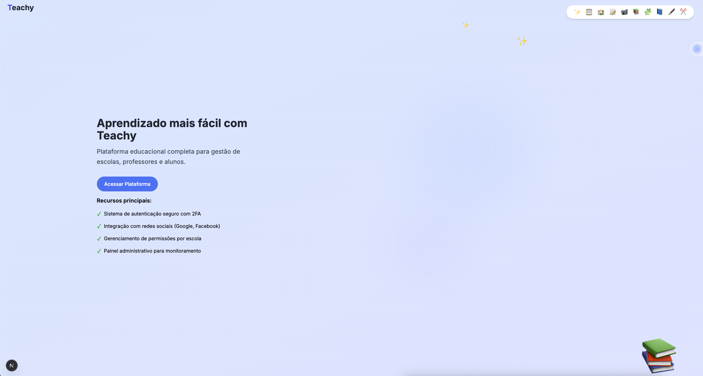
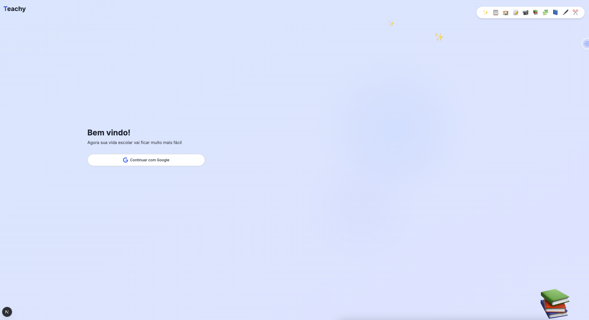
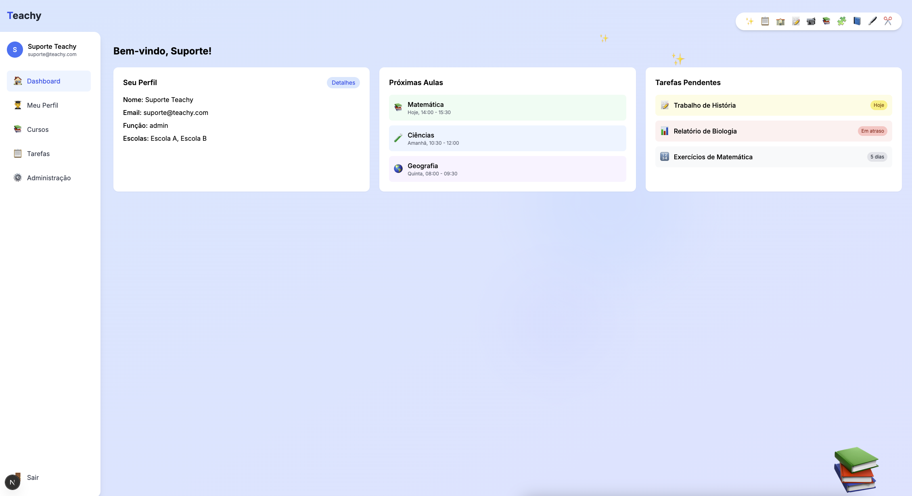

# 🎓 Teachy - Sistema de Autenticação

> Sistema de autenticação e gerenciamento de sessões para a plataforma Teachy, utilizando Next.js e Zitadel como Identity Provider.

## 📌 Sobre

Este projeto implementa um sistema de autenticação e gerenciamento de sessões para a plataforma Teachy, utilizando Next.js como framework principal e Zitadel como Identity Provider (IdP). O sistema é projetado para ser escalável, seguro e fácil de manter.

## 📸 Evidências do Sistema

### Home



### Login



### Dashboard



## 🔧 Configuração

### Pré-requisitos

- Docker
- Make
- Node.js 18+ (para desenvolvimento local)

### Instalação

1. Clone o repositório:

   ```bash
   git clone https://github.com/seu-usuario/teachy-challenge.git
   cd teachy-challenge
   ```

1. Copie o arquivo de exemplo de variáveis de ambiente:

   ```bash
   cp .env.example .env
   ```

1. Ajuste as variáveis de ambiente no arquivo `.env` conforme necessário:
   - `NEXT_PUBLIC_ZITADEL_URL`: URL do Zitadel Cloud (já configurada no exemplo)
   - `NEXT_PUBLIC_ZITADEL_CLIENT_ID`: ID do cliente no Zitadel (já configurado no exemplo)
   - `NEXT_PUBLIC_ZITADEL_PROJECT_ID`: ID do projeto no Zitadel (já configurado no exemplo)
   - `ZITADEL_CLIENT_SECRET`: Secret do cliente no Zitadel (já configurado no exemplo)

## 🚀 Executando o Projeto

### Desenvolvimento

Para iniciar o ambiente de desenvolvimento:

```bash
make setup  # Instala as dependências
make dev    # Inicia o servidor de desenvolvimento
```

O servidor estará disponível em `http://localhost:3000`.

### Build e Produção

Para construir e executar em produção:

```bash
make build  # Constrói a imagem Docker
make prod   # Inicia o servidor em modo produção
```

### Testes e Qualidade

```bash
make test   # Executa os testes
make lint   # Executa o linter
```

### Limpeza

Para parar e limpar o ambiente:

```bash
make clean  # Para e limpa containers, imagens e volumes não utilizados
```

## 📚 Documentação

- [Sistema de Autenticação](docs/authentication-system.md)
- [API (Swagger/OpenAPI)](http://localhost:3000/api-docs) - Acessível quando o servidor está rodando
- [Guia de Configuração do Zitadel](docs/guides/zitadel-configuration.md)
- [Práticas de Segurança](docs/security/security-practices.md)
- [Decisões de Arquitetura](docs/adr/)
  - [Uso do Zitadel como Identity Provider](docs/adr/0001-uso-do-zitadel-como-identity-provider.md)
  - [Uso do Docker para Containerização](docs/adr/0002-uso-de-docker-para-containerizacao.md)
  - [Implementação de 2FA com Zitadel](docs/adr/0003-implementacao-de-2fa-com-zitadel.md)

## 🛠️ Tecnologias

- [Next.js](https://nextjs.org/) - Framework React para produção
- [Zitadel](https://zitadel.com/) - Identity Provider
- [Docker](https://www.docker.com/) - Containerização
- [TypeScript](https://www.typescriptlang.org/) - Tipagem estática
- [Tailwind CSS](https://tailwindcss.com/) - Framework CSS

## 📝 Licença

Este projeto está sob a licença MIT. Veja o arquivo [LICENSE](LICENSE) para mais detalhes.
